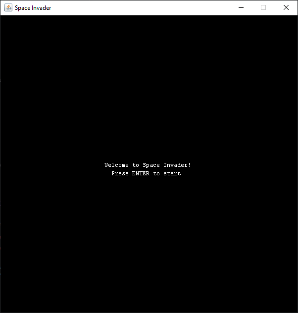
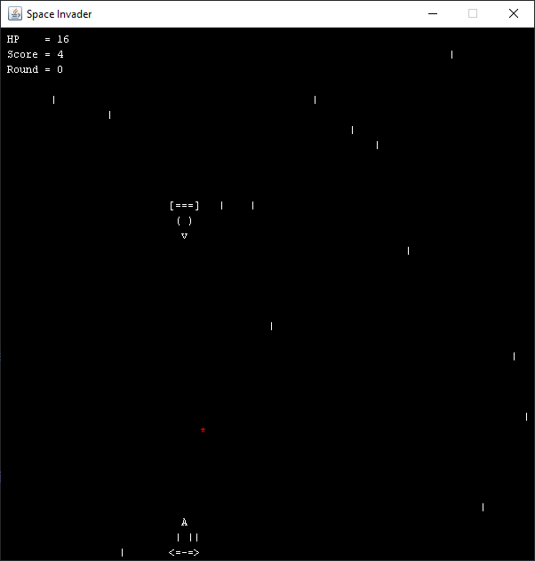
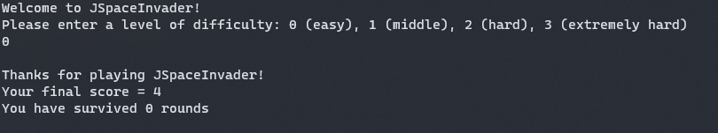

# Space Invader  

A game written in Java, as a homework to CSE389  

------

Was intended to run in terminal, but Java does not support terminal related functions natively  
So turn to JFrame  

See `design.txt` for game object design  

------

### How to play  

In your terminal, run:  
```bash
javac *.java
java Game
```

Select a level and start playing  

### Easy Control  

1. `Esc` or close window to stop the game (`Esc` is recommended)  
2. `W` or `UP` to move up  
3. `A` or `LEFT` to move left  
4. `S` or `DOWN` to move down  
5. `D` or `RIGHT` to move right  
6. `Space` to shoot  

### Documentation  
Generate documentation of this project by:  
```bash
javadoc -d documentation *.java
```

------

### Screenshots  
1. Start screen  
     
2. In-game play  
     
3. Terminal  
     

------

### Potential Improvements  
* Add inertia to enemies' movements, so that they move more fluently  
* Enemy may learn to avoid the bullets  
* Improve the shape and variety of enemies  

------

### Notes  
* It's never a good idea to render on a GUI-purpose interface (not optimized for speed)  
* Also not a good idea to treat it as a terminal (I render the screen using text). I'm just too lazy to learn to use internal drawing components in `java.awt` and design new enemies.
* I knew that there are many more professional options (such as LWJGL) for game rendering, but I don't want to add additional dependencies to this project (supposed to be light-weight).